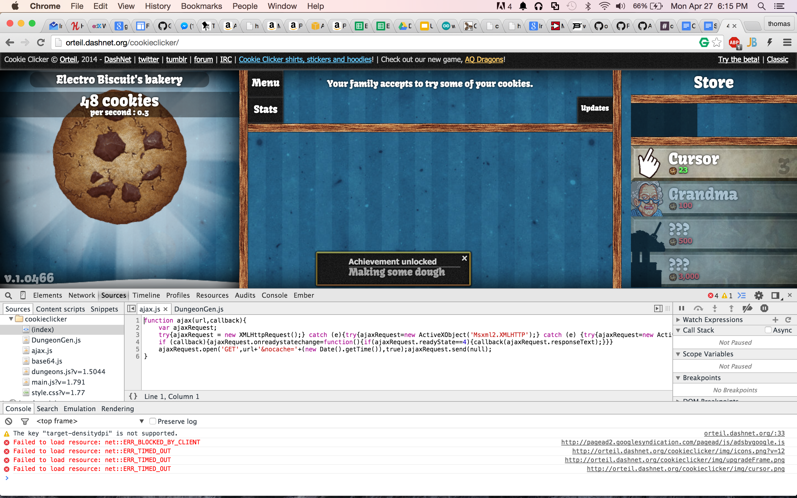
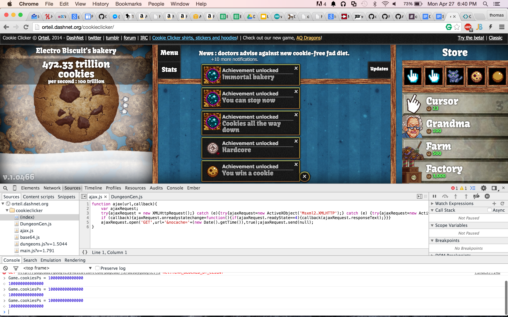

# Lecture
These are the notes from today's lecture.

## Development Console
One of the most important and powerful tools in web development is the development console. All modern browsers have some sort of console available, but the Chrome console is what we will use. Its a great and common browser and very developer friendly.
### Browsers
As a quick aside, all browsers are different. They have gotten much closer in recent years (HTML5 browsers), but you will still run into some differences in how your sites look and function due to these differences. It's worth understanding the different browsers with which people may view your site you so can choose what to optimize:


Some key trends to note include the rise of Chrome as well as the fall of IE and Firefox. Also worth noting is the rapid growth of mobile browsing (pink).
We won't address [mobile web design](http://www.smashingmagazine.com/guidelines-for-mobile-web-development/) in this class, but it is definitely something to consider before launching a new site.

Ok, back to the console. On any webpage, right-click, and select `Inspect Element`. You'll see something like this pop up in the bottom of the window:

The dev console contains a ton of features (seriously, there are more features than I've even heard of).
We'll start with the basic tabs that you use most often:
* Elements: This is a collapsable and editable view of the HTML on the current page. You can double-click to edit fields or [DOM](http://en.wikipedia.org/wiki/Document_Object_Model) nodes. On the right side is a panel showing the CSS styling applied to the element you are highlighting. Again, double-click to edit. A useful shortcut here is the magnifying glass in the top-left corner of the console. Click that and then click in the browser somewhere to jump to the HTML of that element.
* Network: While you're in this tab, refresh the browser. The tab will list all the requests that the web page makes, including the size, timing, and specific response. This can be useful for debugging your server's responses or other API's.
* Sources: The holy grail of JavaScript debugging tools. Set breakpoints, step through code, all the fun stuff that an IDE would give you. We'll get back to this when we go over debugging in more depth.
* Console: A full JavaScript console that operates in the current scope of the Javascript on the page (including inside breakpoints). Run commands, and read through your client-side `console.logs` in this window. **Server-side javascript `console.log` statements will log in your terminal. When you have `console.log` statements in client-side javascript (which we'll discuss more below), they will show up in your developer console.** 
As a bonus, if you click the "console icon"  in the upper-right corner, the console will pop up below whatever other tab you want to reference.

### Javascript Code in Console
With the developer console, you can actually interface and inject your own javascript into a webpage. If you open up the console (as described in last bullet point above) you can type in your own commands and have them execute. Try typing in:
```
alert('hi there')
```

Not only that, you can also see their javascript files and even have access to any variables. Where you find those is under the sources tab in the console. Follow along and pull up their files as shown in the screenshot: 



If you investigate (or just guess) you will notice a variable called "Game" and if you start to type that into the console it will even suggest an autocomplete for it. You can look at its functions and realize that there is a variable called cookiePs, which you might guess corresponds to cookies per second. You can set cookiesPs to any value and see what happens:



The takeaway from all this is that the client is NOT secure. A smart user can take your app apart on the client and do anything he wants with it. All security needs to be implemented on the server side so that it cannot be meddled with. 